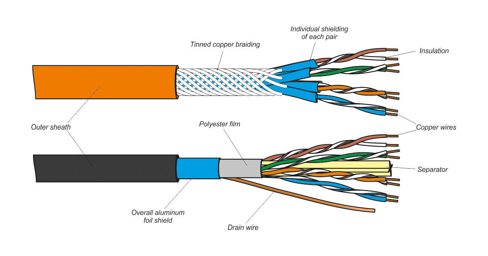
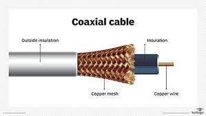
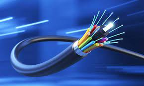
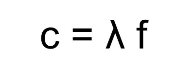
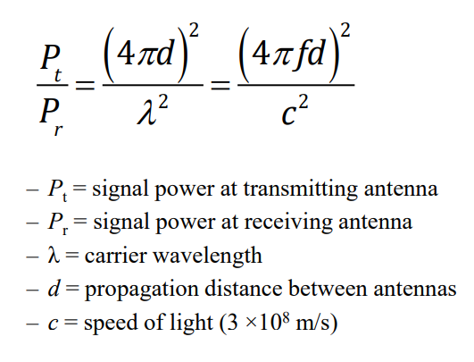

# PHYSICAL LAYER

O objetivo da physical layer é transportar bits de uma máquina para outra.
Se o modo de transmissão depender de cabos físicos entao chama-se **Guided transmission media**.
**Guided transmission media** são cabos de cobre (na forma de um **cabo coaxial** ou **twisted pair**) e **fibra ótica**.

**Bandwidth** é a medida de capacidade de carregamento de um meio de transporte.
Medido em **Hz**.

Formas comuns de transportar dados é escrevê-los em memória persistente, como **discos rígidos**, e transportá-los diretamente para a máquina destinada.
Um camião com milhares de **discos rígidos**, como o "Snowmobile" da Amazon, consegue carregar até 100.000 TB de dados.
Embora a **bandwidth** seja ótima, o delay é um ponto fraco, pois em vez de haver uma diferença de milissegundos entre a chegada de dados, é uma questão de horas ou até dias.

## Guided Transmission Media

Há 3 tipos de **Guided Transmission Media**: **Twisted Pairs**, **Coaxial Cable** e **Fibra Ótica**.

### Twisted Pairs

A forma mais antiga e comum de transmitir dados é o **twisted pair**.

- Consiste em 2 fios de cobre insulados com 1 mm de grossura.
- São dobrados de forma hélica, tipo DNA.
- Ondas de **twists** diferentes cancelam-se.
- O sinal é carregado como a **diferença** de voltagem, e não voltagem **absoluta**, entre os 2 fios de um pair.
- Dá melhor imunidade para noise externo porque o noise afeta a voltagem de ambos os fios de forma igual, portanto a **diferença** mantém-se.
- Conseguem percorrer vários quilómetros sem precisar de amplificação.
- Transportam informação **análoga** ou **digital**.
- **Bandwidth** depende da grossura do fio e da distância percorrida.

Há 3 tipos de ligação diferentes entre 2 máquinas:

- Full-duplex: Ligações que conseguem ser usadas em ambas as direções ao mesmo tempo.
- Half-duplex: Ligações que conseguem ser usadas em ambas as direções, mas só uma de cada vez.
- Simples: Ligações que só conseguem ser usadas em uma direção.

Tipos de cabos **UTP** (Unshielded twisted pair) e a sua **Bandwidth**:

- Cat 3, 16 MHz
- Cat 5/5e, 100 MHz
- Cat 6, 250 MHz
- Cat 6a, 500 MHz
- Cat 7, 600 MHz (Este tem proteção à volta dos pairs individuais como também à volta do cabo inteiro, ou seja, não é unshielded)

### Coaxial Cable

Um modo de transmissão de dados também comum é o **coaxial cable**.

- Melhor shielding que **UTPs**
- Melhor **Bandwidth** que **UTPs**
- Boa imunidade a noise
- Baixa atenuação

Há 2 tipos de cabos coaxiais:

- Cabos de 50Ω (Ohm's), feitos para transmissão digital
- Cabos de 75Ω, feitos para transmissão análoga e televisão a cabo

Cabos coaxiais têm **Bandwidth** elevada, até 6 GHz.
Recentemente, fibra ótica têm substituído cabos coaxiais em sistemas de telefones a longa distância.
Cabos coaxiais são usados, também, para conexões de Internet de alta-velocidade para casas.

### Fibra ótica

Fibra ótica é usada para transmissão de dados de longa distância, LANs de alta velocidade e acesso de alta velocidade à Internet.

- **Bandwidth** muito elevada, até 30.000 GHz
- Atenuação super baixa, < 1dB/km
- Não é afetada por oscilações de energia, interferências eletromagnéticas ou falhas de energia
- É mais fina e mais leve que cobre

Há 3 tipos de modos de transmitir raios de luz por uma fibra ótica:

- Step-index multimode
- Graded-index multimode
- Single mode

Em tipos **multimode**, cada raio salta entre os 2 lados da fibra ótica, em ângulos diferentes.
Se o diâmetro da fibra for menor que 10 microns, a fibra age como um guia.

## Wireless Transmission

Com uma antena ligada a um circuito elétrico, ondas eletromagnéticas podem ser transmitidas e recebidas por um recetor.

O número de oscilações por segundo de uma onde chama-se **frequência** (***f***), medido em Hz.
A distância entre 2 consecutivos máximos de uma onda, ou mínimos, chama-se **wavelength** (***λ***), medido em metros.
No vácuo, qualquer onda eletromagnética anda à velocidade da luz ***c***, aproximadamente 300.000.000 m/s.

No vácuo, a relação fundamental entre ***f***, ***λ*** e ***c*** é:

Por exemplo:

- Uma onda com 100 MHz de **frequência** tem 3 metros de **wavelength**
- Uma onda com 1000 MHz de **frequência** tem 0.3 metros de **wavelength**
- Uma onda com 3000 MHz de **frequência** tem 0.1 metros de **wavelength**

### Radio Transmissions

Há diversas vantagens para troca de dados através de ondas rádio:

- São fáceis de generar
- Percorrem longas distâncias
- Conseguem atravessar edifícios
- Omnidirecionais, i.e andam em todas as direções

Por estas razões ondas rádio são muito utilizadas para comunicação tanto indoors como outdoors.

Podemos calcular a força do sinal de uma onda rádio através desta fórmula:

